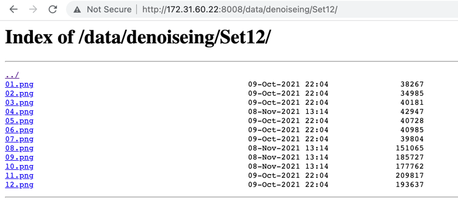
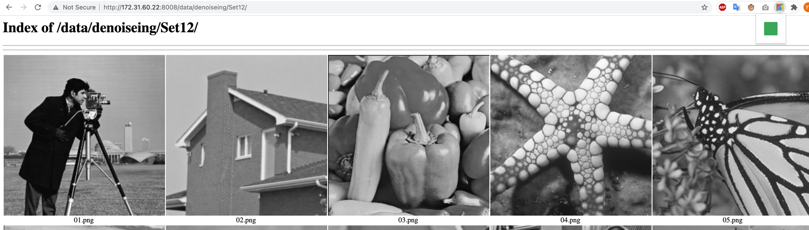

# preview-image-in-nginx-server
or
# The Preview of images in pages
This is a chrome pluging. 

Sometimes we are build a http service for file system by use the nginx. If in some folders only contain images, then we visit it in chrome browse, we just see a file list,but can not watch the image directely.So I write this chrome plugging.

For example , blow is my file list in my service 

Then we just click the plugging button , the list page will turn to image view page . We just onle click the plugging button again , the page can back.

# how to install 

1. Download this repository . 
2. Paste the code `chrome://extensions/` in chrome
3. enable 'Developer mode' in page  top right position
4. Click 'Load unpacked' button , then choose the getting-started folder. Click ok.
5. When you want to view image , just click the plugging button.
